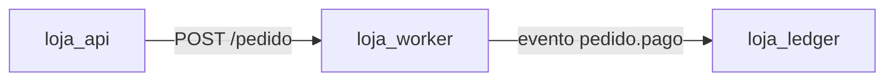

# MAPA da aplicação — <project>

Guia detalhado de **onde está cada coisa, para que serve e como entra/sai**.
Obrigatório por `references/padroes-codigo.md` (§4). Atualize no mesmo PR que
mexe no código. Duas camadas:

- **Global** — mantido à mão (repos, pastas, módulos, comunicação, entradas/saídas).
- **Microfunções** — gerado por `/<slug>-index` a partir dos doc-comments.

> **Exaustivo (não resumo):** uma entrada **por função** — `nº de entradas == nº de funções` do serviço. O MAPA é um **grafo**, não uma lista: inclui o **grafo de serviços** (§2.5) e o **grafo de chamadas** (§5), em Mermaid + adjacência.

---

## 1. Visão geral

- **O que é:** <uma linha sobre o sistema>
- **Stack:** <linguagem(s), framework, banco, fila>
- **Pontos de entrada:** <rotas HTTP / CLIs / jobs / consumers>
- **Pontos de saída:** <banco / filas / APIs externas / arquivos>

## 2. Mapa de módulos (global, à mão)

| Módulo / pasta | Responsabilidade | Depende de | É usado por |
|---|---|---|---|
| `caminho/` | <o que faz> | <módulos> | <chamadores> |

## 2.5 Grafo de serviços (Mermaid + adjacência)

Todos os microserviços como nós; arestas = quem chama/notifica quem (rótulo = rota/evento/fila). **Nenhum serviço de fora.**

Adjacência (fonte pesquisável): `api -> worker (POST /pedido)` · `worker -> ledger (evento pedido.pago)`.

## 3. Fluxos principais (entrada → saída)

Para cada fluxo de negócio, a cadeia ponta a ponta:

- **<fluxo>**: entrada `<rota/evento>` → `<função/arquivo>` → `<função/arquivo>`
  → saída `<banco/fila/resposta>`

## 4. Microfunções (GERADO — não editar à mão)

> Preenchido por `/<slug>-index` a partir dos doc-comments (§3 de
> `padroes-codigo.md`). Cada entrada traz: onde está, para que serve,
> dependências, auxiliares/chamadores, entrada e saída. **Exaustivo:** uma entrada
> por função de cada serviço (`nº entradas == nº funções`); o `/<slug>-index` reprova se faltar.

<!-- BEGIN: index-funcoes -->
<!-- (gerado) -->
<!-- END: index-funcoes -->

## 5. Grafo de chamadas (GERADO — não editar à mão)

> Gerado por `/<slug>-index`: por função, quem ela **chama** (out) e quem a **chama** (in).
> Percorre-se do ponto de entrada até a saída; mede o raio de impacto.

<!-- BEGIN: grafo-chamadas -->
<!-- (gerado: Mermaid flowchart + adjacência chamador -> chamada) -->
<!-- END: grafo-chamadas -->
